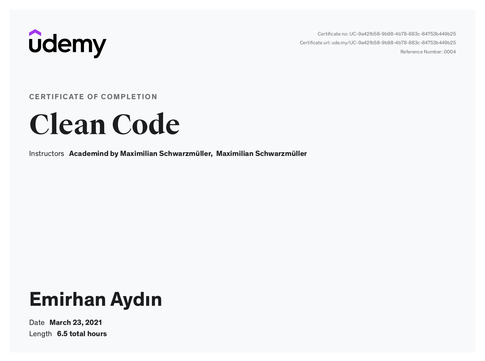
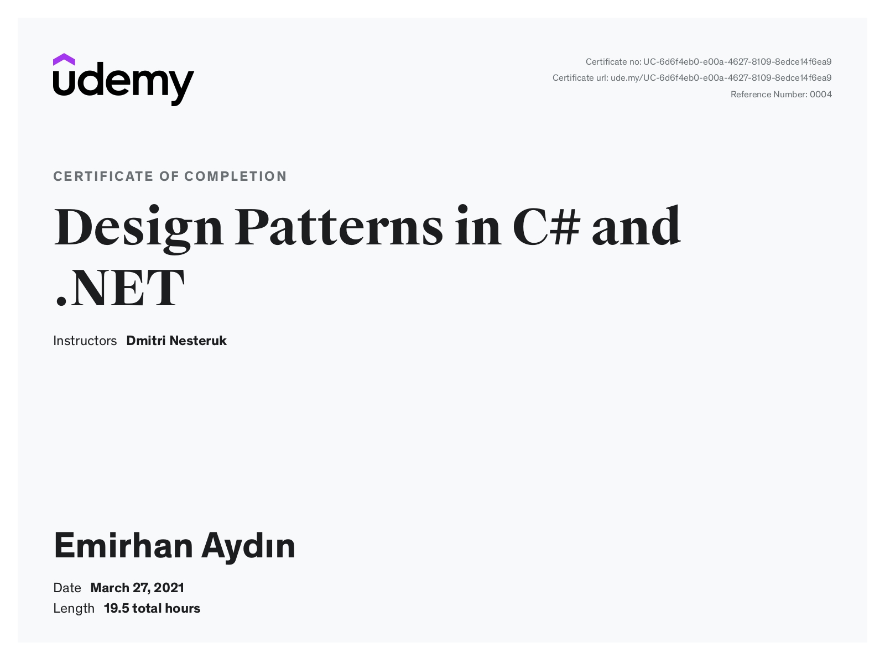
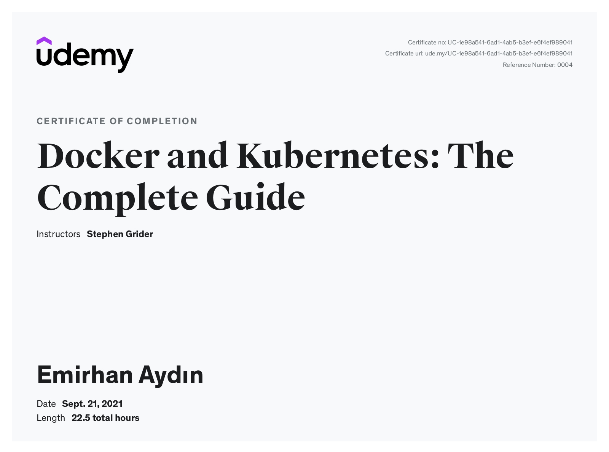
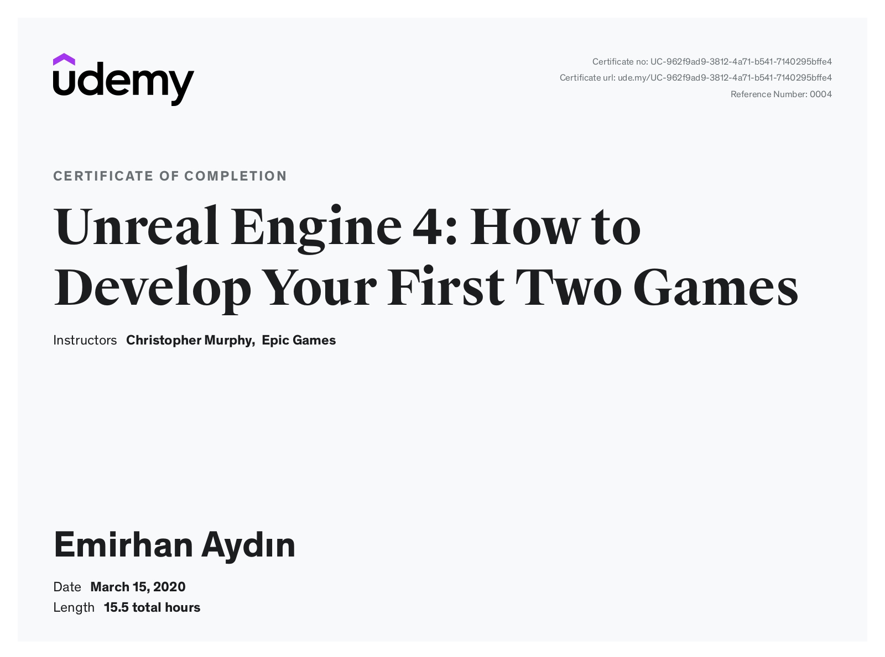

_Welcome to my profile_

I plan to include more details about me here in the future.

## My Udemy Certificates

* [Clean Code](https://www.udemy.com/course/writing-clean-code/)

* [Complete Guide to Protocol Buffers 3 [Java, Golang, Python]](https://www.udemy.com/course/protocol-buffers/)
![Complete Guide to Protocol Buffers 3 [Java, Golang, Python]](certificates/udemy/complete_guide_to_protocol_buffers_3_java_golang_python.jpg "Complete Guide to Protocol Buffers 3 [Java, Golang, Python]")

* [Design Patterns in C# and .NET](https://www.udemy.com/course/design-patterns-csharp-dotnet/)

* [Docker and Kubernetes: The Complete Guide](https://www.udemy.com/course/docker-and-kubernetes-the-complete-guide/)

* [Go: The Complete Developer's Guide (Golang)](https://www.udemy.com/course/go-the-complete-developers-guide/)
")

* [gRPC [Golang] Master Class: Build Modern API & Microservices](https://www.udemy.com/course/grpc-golang/)
![gRPC [Golang] Master Class: Build Modern API & Microservices](certificates/udemy/grpc_golang_master_class_build_modern_api_and_microservices.jpg "gRPC [Golang] Master Class: Build Modern API & Microservices")

* [Unreal Engine 4: How to Develop Your First Two Games](https://www.udemy.com/course/unreale4/)
